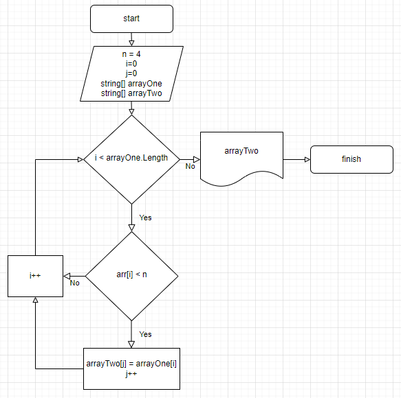

# Итоговая работа
Поскольку работа выполняется после изучения основ Python, а в условии задачи не указан язык программирования, выполним данное задание на Python
## Задача

Написать программу, которая из имеющегося массива строк формирует новый массив из строк, длина которых меньше либо равна 3 символам. Первоначальный массив можно ввести с клавиатуры, либо задать на старте выполнения алгоритма. При решении не рекомендуется пользоваться коллекциями, лучше обойтись исключительно массивами.

**Примеры:**
- `["Hello", "2", "world", ":-)"]` → `["2", ":-)"]`
- `["1234", "1567", "-2", "computer science"]` → `["-2"]`
- `["Russia", "Denmark", "Kazan"]` → `[]`

## Алгоритм решения

1. Создаем и заполняем строковый массив случайными значениями.
2. Определяем количество элементов в данном массиве, длина которых меньше или равна 3 символам. Это количество будет определять размер нового массива для переноса элементов.
3. Создаем новый массив определённой ранее длины, заполняем его значениями по тому же условию (длина элементов из начального массива меньше или равна 3 символам).
4. Выводим результаты переноса элементов из первоначального строкового массива в новый строковый массив согласно условию задачи.

## Дополнительная информация

Добавили блок-схему алгоритма решения задачи.

## Пояснения по коду

1. **Функция `fill_rand_arr(size)`**:
   - Создает массив строк случайной длины (от 1 до 7 символов) из случайных символов.
   - Использует символы из набора: латинские буквы (в верхнем и нижнем регистре), цифры и специальные символы.

2. **Функция `get_size_of_second_array(arr)`**:
   - Определяет количество строк в массиве `arr`, длина которых меньше `n`.
   - Возвращает это количество, которое будет использовано для создания нового массива нужного размера.

3. **Функция `rotate_elem_of_arr(arr)`**:
   - Создает новый массив, включающий только те строки из `arr`, длина которых меньше `n`.
   - Проходит по всем строкам исходного массива и добавляет подходящие строки в новый массив.

4. **Основная часть программы**:
   - Создает и заполняет исходный массив `array_one` случайными строками, используя функцию `fill_rand_arr(size)`.
   - Проверяет, есть ли строки, длина которых меньше `n`, с помощью функции `get_size_of_second_array(arr)`. Если таких строк нет, выводит соответствующее сообщение.
   - Если такие строки есть, выводит исходный массив и новый массив, включающий строки длиной меньше `n`.
   - Новый массив создается и заполняется функцией `rotate_elem_of_arr(arr)`.

### Пример вывода программы
    Перед вами строковый массив, заполненный случайными значениями, и новый массив, впитавший в себя элементы предыдущего массива, длина которых равна трём или менее символов:
    [abc, d, efg, hijk, lmn, o, pq, rstu, vw, x] -> [d, o, pq, vw, x]
